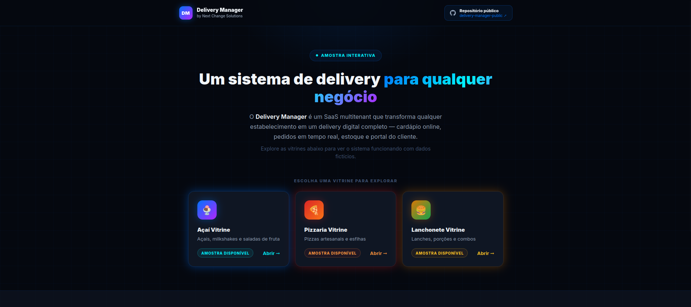
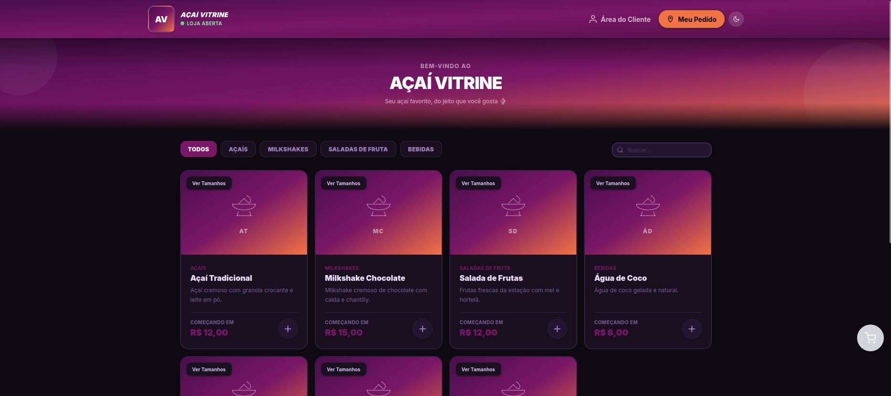
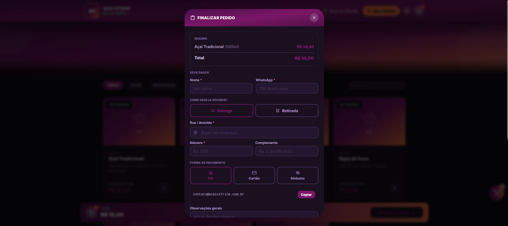
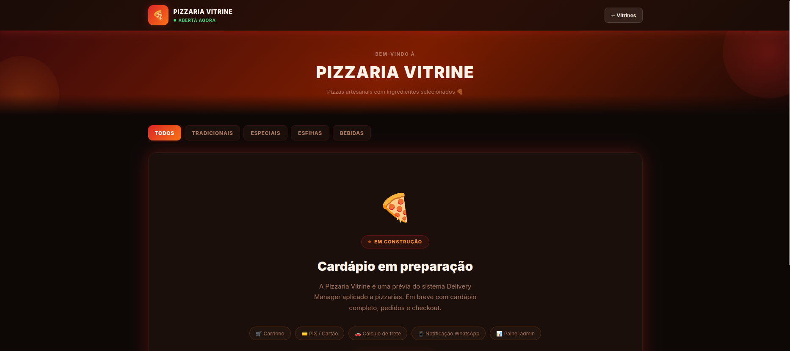
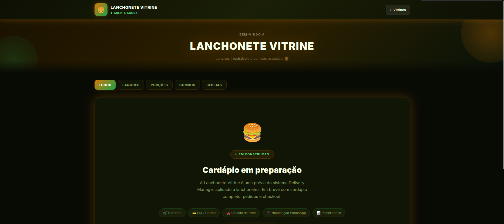

# 🛵 Delivery Manager

> Sistema SaaS multitenant de gestão de delivery — com storefront público, painel administrativo e portal do cliente.

Este repositório é uma **vitrine pública** do projeto. O código-fonte é proprietário e mantido em repositório privado.

---

### 📂 Versões disponíveis

[](./README.md)
[](./README-django.md)

---

[](https://nextjs.org)
[](https://fastapi.tiangolo.com)
[](https://typescriptlang.org)
[](https://tailwindcss.com)

---

## 🖥️ Ambientes disponíveis

> ⚠️ **Todos os ambientes utilizam backend simulado com dados fictícios.** Nenhum dado real é processado ou armazenado.

| | **Versão Atual — Next.js + FastAPI** | **Versão Legado — Django** |
|---|---|---|
| **Stack** | Next.js 15 · TypeScript · FastAPI · PostgreSQL | Python 3 · Django · Bootstrap · PostgreSQL |
| **Deploy** | Vercel + Hetzner | Render |
| **Acesso** | [🔗 Abrir na Vercel](https://delivery-manager-showcase.vercel.app/) | [🔗 Abrir no Render](https://delivery-manager-pbsj.onrender.com/) |
| **Documentação** | ← *você está aqui* | [📄 README Django](./README-django.md) |

> ⏳ O Render pode levar ~30s para iniciar na primeira requisição (free tier).

### 🔑 Credenciais de acesso

| Área | URL | Credenciais |
|---|---|---|
| Frontpage / Vitrine | `/storefront` | ✅ Sem login — acesso público |
| Painel Administrativo | `/login` | Qualquer e-mail + qualquer senha |
| Portal do Cliente | `/cliente/login` | Qualquer e-mail/telefone + qualquer senha |

---

## 🗂️ Segmentos disponíveis na vitrine

A frontpage apresenta o produto e permite escolher entre três tipos de estabelecimento, cada um com cardápio, fluxo de pedido e identidade visual próprios:

| Segmento | URL | Status |
|---|---|---|
| 🍧 Açaí Vitrine | `/storefront/acai` | ✅ Disponível |
| 🍕 Pizzaria | `/storefront/pizzaria` | ✅ Disponível |
| 🍔 Lanchonete | `/storefront/lanchonete` | ✅ Disponível |

---

## 📸 Screenshots

### Frontpage — Vitrine do produto

| Hero / Apresentação | Seleção de segmento |
|---|---|
|  |  |

### Storefront — Açaí Vitrine

| Cardápio | Carrinho / Checkout |
|---|---|
|  |  |

### Storefront — Pizzaria

| Cardápio | Carrinho / Checkout |
|---|---|
|  |  |

### Storefront — Lanchonete

| Cardápio | Carrinho / Checkout |
|---|---|
|  |  |

### Painel Administrativo

| Dashboard | Gestão de Pedidos |
|---|---|
|  |  |

| Cadastro de Produtos | Controle de Estoque |
|---|---|
|  |  |

### Portal do Cliente

| Dashboard do cliente | Programa de Fidelidade |
|---|---|
|  |  |

> 📌 Adicione as capturas na pasta `screenshots/` para ativar as imagens acima.

---

## 🧩 Funcionalidades

### Painel Administrativo
- Dashboard com métricas em tempo real: vendas, ticket médio, pedidos por hora, top produtos
- Gestão de pedidos com pipeline de status: `pendente → confirmado → preparando → saiu para entrega → entregue`
- Cadastro de produtos com múltiplos tamanhos (300ml, 500ml, 700ml, 1L) e preço único
- Cadastro de categorias e adicionais
- Controle de estoque com histórico de movimentações
- Relatório financeiro básico
- Configurações da loja: horário, taxas, formas de pagamento, cores, logo

### Storefront público
- Frontpage com apresentação do produto e seleção de segmento
- Cardápio organizado por categorias com busca
- Modal de produto com seleção de tamanho e adicionais
- Carrinho persistente com edição e duplicação de itens
- Checkout com endereço, forma de pagamento e troco
- Integração PIX com QR Code ou chave
- Rastreamento de pedido em tempo real

### Portal do Cliente
- Cadastro e login por e-mail ou telefone
- Histórico de pedidos com detalhes
- Gerenciamento de endereços salvos
- Programa de fidelidade com pontos e cartão de selos
- Resgate de recompensas

---

## 🏗️ Arquitetura

```
Cliente final         Admin / Gerente        Cliente logado
     │                      │                      │
     ▼                      ▼                      ▼
 Storefront             Dashboard              Portal Cliente
     └──────────────────────┼──────────────────────┘
                            │
                     Next.js 15 (Vercel)
                            │
                     FastAPI (Hetzner)
                            │
                    PostgreSQL 16 + Redis 7
```

### Stack técnica

**Frontend**
- Next.js 15 (App Router) + TypeScript
- TailwindCSS + shadcn/ui
- Zustand (estado global) · React Hook Form + Zod (formulários) · TanStack Query (cache e fetching)

**Backend**
- FastAPI (Python 3.12) + SQLAlchemy + Alembic
- PostgreSQL 16 + Redis 7
- WebSockets para atualizações de pedidos em tempo real

**Infraestrutura**
- Vercel (frontend)
- Hetzner CX22 + Coolify + Docker (API e banco)
- Cloudflare R2 (armazenamento de imagens)
- Evolution API (notificações WhatsApp) · Resend (e-mails transacionais) · Stripe + Pagar.me (pagamentos)

### Multitenancy

Cada estabelecimento opera em subdomínio próprio (`loja.dominio.com.br`). Isolamento completo por `tenant_id` em todas as tabelas, com Row Level Security no PostgreSQL garantindo que nenhum tenant acesse dados de outro.

---

## 👨‍💻 Equipe

| Dev | GitHub |
|---|---|
| **Lucas Rocha** | [@edlucaz](https://github.com/edlucaz) |
| **Felipe Rocha** | [@FlpRocha236](https://github.com/FlpRocha236) |

---

## 💼 Sobre

Produto desenvolvido pela **[Next Change Solutions](https://nextchange.com.br)**.

Para informações comerciais, demonstração personalizada ou contato técnico:

- 📧 rocha.edllucaz@gmail.com
- 💼 [linkedin.com/in/edlucazrocha](https://linkedin.com/in/edlucazrocha)
- 🐙 [github.com/edlucaz](https://github.com/edlucaz)

---

*Código-fonte proprietário. Todos os direitos reservados. © Next Change Solutions.*
